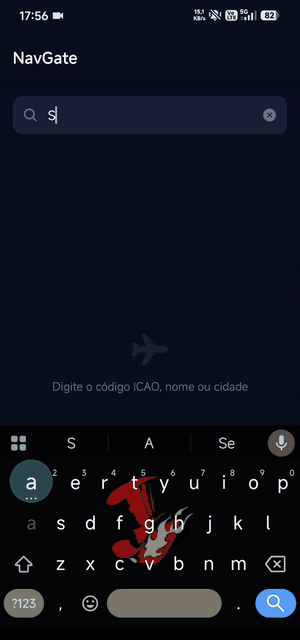
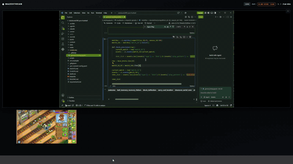

  

<h2>I build the tools I need myself.</h2>

I write parsers for a living — the kind that turn Brazilian
regulatory filings into something a person can actually read.

Everything else here follows the same rule: I fly, so I built a
flight planner. I run an RPG table, so I built the room it meets in.

<i>home → RPG → code → break something → understand why → ⟳</i>

 

  

<!-- ─────────────  NavGate · GIF left  ───────────── -->

### [NavGate](https://github.com/Davi-Tlr/NavGate)

**Every good VFR planner charges in dollars and is built for someone else's airspace.**

So this one is built for Brazil. MapLibre aeronautical charts pulled
straight from DECEA, live METAR/TAF off the NOAA feed, route legs solved
by Haversine, terrain profiles under the track — and 4,609 airfields that
still answer with the phone in airplane mode.

`React Native` `TypeScript` `Expo` `MapLibre` `SQLite`

More screens

 

 

  

<!-- ─────────────  Mazestream · GIF right  ───────────── -->

### [Mazestream](https://github.com/Davi-Tlr/Mazestream)

**My table needed a room that fit it, so the room has an RPG mode.**

Screen sharing over LiveKit and WebRTC, with a shared whiteboard,
pointers that fade on their own, and clips cut in the browser so the
server never has to record a thing. Two screens fit on stage at once.
Runs on localhost or on your own box behind Docker Compose.

`React` `LiveKit` `WebRTC` `Docker` `Node.js`

<i>the green is my friend's editor theme, not the app. I have raised it with him.</i>

 

  

<!-- ─────────────  Day job  ───────────── -->

### The day job

Brazilian financial and regulatory data arrives as PDFs, fixed-width text
and XML that was never meant to be read twice. I write the Python that
reads it anyway — parsers, reconciliation, and the automation that keeps
an analyst from doing it by hand.

<b>What that actually looks like</b>

 

A filing lands as a 200-page PDF with tables that span pages, or as a
fixed-width file where column 47 means something different depending on
what column 12 said. The job is never the happy path — it's the footnote
that shifts every row below it, the encoding that changes mid-file, the
total that doesn't reconcile because one record was amended six months later.

Most of that work lives in private repositories. What I can say is that it
taught me more about edge cases than any tutorial ever did.

 

  

<!-- ─────────────  The table  ───────────── -->

### The table

I've been running the same campaign long enough that it needed software
of its own — Foundry VTT modules, a streaming room, and a few things I
can't show here.

<i>My players know this GitHub. No spoilers.</i>

 

<!-- DICE:START -->

### The Forgotten Cistern of the Quiet King

**The floor lies on level 4.** The party is on level 3 with
1 torch lit. Reach the floor and the relic comes up with
them; let the last torch go out and the dungeon keeps it.

Roll a d20 to move them — it opens a pre-filled issue, just press **Create**.
High takes them deeper, low costs light.

**[d20](https://github.com/Davi-Tlr/Davi-Tlr/issues/new?title=roll:d20&body=Press+Create.)** &nbsp;·&nbsp; won 0 · lost 0

  

the vault &nbsp;·&nbsp; 0 recovered

 
Empty. Nothing has been brought back yet.

`d20` **10** · [@Davi-Tlr](https://github.com/Davi-Tlr) went down through water that came to the knee, and lost a torch to it `d20` **4** · [@Davi-Tlr](https://github.com/Davi-Tlr) retreated up a level with something following, and did not look back `d20` **15** · [@Davi-Tlr](https://github.com/Davi-Tlr) crossed the bridge over the underground river without waking anything

 
<!-- DICE:END -->

  

  Python · JavaScript · TypeScript · React Native · Docker · Linux · SQL

  
  &nbsp;
  

